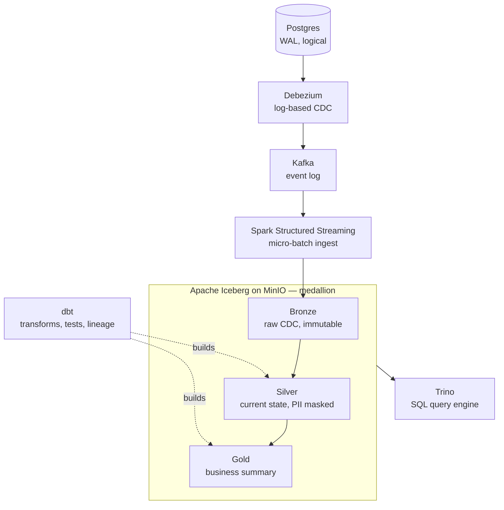

# Streaming Lakehouse — CDC to Iceberg with dbt and Trino

A real-time data lakehouse that captures row-level changes from a transactional Postgres database and lands them in an Apache Iceberg medallion architecture, queryable through Trino and transformed with dbt. Built as a single-node stack on Docker Compose.

This is the modern, log-based-CDC replacement for nightly batch ETL: instead of polling tables on a schedule, it streams every insert, update, and delete off the Postgres write-ahead log the moment it commits.

> Author: Aaditya Kumar Singh

## Architecture



| Stage | Technology | Role |
|-------|-----------|------|
| Source | PostgreSQL 16 (`wal_level=logical`) | Transactional `banking` database; logical replication for CDC |
| Capture | Debezium (Kafka Connect) | Log-based CDC off the Postgres WAL — no polling, no source-table load |
| Transport | Kafka (KRaft mode) | Durable event log; topic `banking.public.accounts` |
| Ingest | Spark Structured Streaming | Reads CDC events, writes 60-second micro-batches to Iceberg |
| Storage | Apache Iceberg on MinIO (S3-compatible) | Bronze layer = immutable, append-only CDC event log |
| Catalog | Iceberg REST catalog (`tabulario/iceberg-rest`) | Table metadata; shared by Spark (writer) and Trino (reader) |
| Query | Trino | SQL over Iceberg, including time-travel and metadata tables |
| Transform | dbt (`dbt-trino`) | Bronze → silver → gold models, data-quality tests, lineage docs |

### Medallion layers

- **Bronze** (`lake.bronze.accounts`) — raw CDC events as Debezium emits them. Append-only and immutable; the audit log / system of record.
- **Silver** (`lake.silver.accounts_current`) — current state per account, deduplicated via `row_number()`, deletes dropped, PII (`customer_name`) tokenized with a one-way SHA-256 hash.
- **Gold** (`lake.gold.account_summary`) — business-facing portfolio rollup: total/avg/min/max balance and account count per status.

## Repository layout

```
streaming-lakehouse/
├── docker-compose.yml          # all services
├── source/                     # Postgres schema + transaction generator
│   ├── schema.sql
│   └── txn_generator.py
├── debezium/
│   └── accounts-connector.json # Debezium connector config
├── streaming/
│   └── cdc_to_bronze.py        # Spark Structured Streaming job (CDC → bronze)
├── trino/
│   └── catalog/lake.properties # Trino Iceberg REST catalog config
├── maintenance/
│   └── maintain.py             # Iceberg table maintenance (compaction, etc.)
├── dbt/
│   ├── dbt_project.yml
│   ├── profiles.yml
│   ├── macros/
│   │   └── generate_schema_name.sql   # clean per-layer schema names
│   └── models/
│       ├── silver/accounts_current.sql + schema.yml
│       └── gold/account_summary.sql + schema.yml
└── data/                       # local Postgres + MinIO volumes (gitignored)
```

## Running the pipeline

### 1. Start the stack

```bash
docker compose up -d
```

Confirm all containers are healthy: `postgres`, `kafka`, `connect`, `kafka-ui`, `minio`, `mc`, `iceberg-rest`, `trino`.

### 2. Start the data generator

```bash
source .venv/bin/activate
python source/txn_generator.py   # leave running in its own tab
```

### 3. Register the Debezium connector

Required after every `docker compose down` (the registration lives in Kafka's internal topics, which a teardown wipes).

```bash
curl -X POST -H "Content-Type: application/json" \
  --data @debezium/accounts-connector.json \
  http://localhost:8083/connectors

curl -s http://localhost:8083/connectors/banking-connector/status | python3 -m json.tool
```

Expect `"state": "RUNNING"`. A `409 Conflict` means it already exists and is healthy.

### 4. Run the streaming ingest

```bash
export AWS_REGION=us-east-1
export AWS_ACCESS_KEY_ID=minioadmin
export AWS_SECRET_ACCESS_KEY=minioadmin
python streaming/cdc_to_bronze.py
```

First run downloads JARs (a few minutes). Let it commit several 60-second micro-batches, then Ctrl-C.

### 5. Transform with dbt

```bash
cd dbt
dbt run --profiles-dir .
dbt test --profiles-dir .
dbt docs generate --profiles-dir .
dbt docs serve --profiles-dir .   # lineage/catalog site
cd ..
```

### 6. Query in Trino

```bash
docker compose exec trino trino
```

```sql
SELECT * FROM lake.gold.account_summary;
```

Sample output:

```
 status | account_count | total_balance | avg_balance | min_balance | max_balance
--------+---------------+---------------+-------------+-------------+-------------
 frozen |            47 |     111081.34 |     2363.43 |    -2189.36 |     6362.08
 active |             4 |       6733.66 |     1683.42 |     -485.89 |     3683.53
```

### 7. Time-travel demo (point-in-time auditability)

Iceberg keeps a snapshot per commit, so you can query the table as it existed at any past snapshot:

```sql
-- list snapshots
SELECT committed_at, snapshot_id FROM lake.bronze."accounts$snapshots" ORDER BY committed_at;

-- query the table as of an earlier snapshot (paste a real snapshot_id)
SELECT count(*) FROM lake.bronze.accounts FOR VERSION AS OF <snapshot_id>;
```

### 8. Table maintenance

```bash
export AWS_REGION=us-east-1
export AWS_ACCESS_KEY_ID=minioadmin
export AWS_SECRET_ACCESS_KEY=minioadmin
python maintenance/maintain.py
```

Runs Iceberg compaction (`rewrite_data_files`), manifest rewrite, and snapshot expiry, reporting data-file count before/after.

## Operational notes and gotchas

The non-obvious things that will bite you (and did, during the build):

### Python 3.14 and the mashumaro override

This stack runs on Python 3.14, ahead of what much of the data ecosystem supports. dbt's bundled `mashumaro` fails at import on 3.14 (`UnserializableField: Field "schema" ... is not serializable`). **Fix:** pin `mashumaro==3.22`, ahead of dbt's stated upper bound. pip warns about a dependency conflict, but dbt runs correctly. Don't let a future `pip install` downgrade it.

### Debezium encodes NUMERIC as base64 Decimal

By default Debezium serializes Postgres `NUMERIC`/`DECIMAL` columns as base64-encoded `org.apache.kafka.connect.data.Decimal` bytes, not plain numbers. A Spark `from_json` schema declaring the column as `DOUBLE` then silently parses it to NULL. **Fix:** add `"decimal.handling.mode": "double"` to the connector config and re-register it. (For real fintech use, `"string"` preserves exact precision — parse to `DECIMAL` in Spark to avoid float drift on currency.)

### Connector config changes require delete + recreate

A `409` on POST means the old connector persists. To apply config changes:

```bash
curl -X DELETE http://localhost:8083/connectors/banking-connector
curl -X POST -H "Content-Type: application/json" --data @debezium/accounts-connector.json http://localhost:8083/connectors
```

Config changes only affect future events. To reprocess cleanly, drop the bronze table and clear the Spark checkpoint at `s3a://lakehouse/checkpoints/bronze_accounts` before re-running.

### dbt schema names: the generate_schema_name macro

dbt-trino concatenates target schema + a model's custom `+schema` (so `+schema: gold` under target `silver` yields `silver_gold`). A `generate_schema_name` macro override makes custom schema names literal, giving clean `silver` and `gold` schemas. See `dbt/macros/generate_schema_name.sql`.

### Trino dropped the Hadoop Iceberg catalog

Current Trino removed `iceberg.catalog.type=hadoop`. This stack uses an Iceberg **REST catalog** shared by Spark (writer) and Trino (reader), both pointing at `http://iceberg-rest:8181`. Spark uses `org.apache.iceberg.aws.s3.S3FileIO` with `s3://` paths (not `s3a://`).

### Orphan-file removal runs separately

`maintain.py` deliberately omits `remove_orphan_files`: it does a recursive filesystem listing (not via S3FileIO) and can delete files a concurrent writer is mid-commit on. In production it belongs on its own conservative schedule with a long `older_than` window.

### SQL identifier quoting differs

- Trino quotes Iceberg metadata tables with double quotes: `lake.bronze."accounts$files"`
- Spark uses backticks / dot syntax: `lake.bronze.accounts.files`

### Other

- **Postgres port conflict:** a local Homebrew `postgresql` on 5432 silently intercepts connections meant for the container — `brew services stop postgresql@<version>`.
- **SSL warning from dbt-trino:** expected for a local no-cert stack; set `require_certificate_validation: true` in production.
- **Kafka listeners:** split into `kafka:19092` (internal) and `localhost:9092` (external, for the host-side Spark job). A single advertised listener of `kafka:9092` is unresolvable from the host.

## Status

Verified end to end: Postgres CDC → Debezium → Kafka → Spark → Iceberg/MinIO → Trino, with dbt silver and gold models, passing data-quality tests, generated lineage docs, and a working Iceberg maintenance routine.